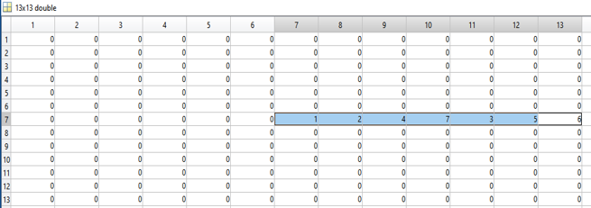

# MULTI-ROW PANORAMIC IMAGE STITCHING

**Mohamad Belal ALKassab**

---

## Introduction

- Panorama image stitching these days:
  Panoramas from smartphones these days are almost always made in a horizontal or vertical direction.

- What is multi-row panorama?
  Multi-row panorama is a panorama that contain multiple rows of images allowing the camera to be panned in a vertical and/or horizontal way at the same time, thus creating an even bigger panorama.

- Is there any way of creating multi-row panoramas currently?
  There are private photography services that create and capture multi-row panoramas using their specialized cameras or by receiving images from the customer to stitch them and send back the resulting panorama. However, if privacy is important or if time is limited or for any other reason, the user might want to make a multi-row panorama using their own camera and process it on their own device.

*Single Row vs Multi Row Panorama*

---

## Methodology

1. The images are acquired from the camera or uploaded by the user.
2. The camera calibration matrix is applied to the images to remove lens distortion.
3. The features from the undistorted images then get extracted using SIFT or SURF.
4. The center image is then found and used as the zero point for all pictures.
5. Determine which edges of images should be stitched together.

---

## Feature-Based Image Stitching

- The matching features between the images were found using Upright SURF.
- The geometric transformation was estimated using RANSAC and outliers were eliminated.
  

---

## Ordering Images

- Images are ordered using feature matching between image pairs.
- Grouping is done by maximum matching features.
- Direction of the transformation helps determine order.

*Unordered Images*

To handle multi-row panoramas, the image ordering code creates an array starting from the first image. This allows flexible ordering in any direction.

*Order direction array*

*Ordered Images*

*Result of images after ordering and stitching*

---

## Methodology Continued

6. Create a blank frame large enough to contain the final panorama.
7. Use AlphaBlender to smooth overlapping edges.
8. Add the center image, then stitch and warp others.
9. Iterate until stitching is complete.
10. Remove black edges from the result.

---

## Blending the Edges

Edge blending was implemented using a fading gradient to preserve center brightness.

---

## Results

- Multi-row panorama stitching was successful within a limited field of view.
- Upright SURF was faster than SIFT.
- Image ordering worked for small sets.
- Affine and planar projections were both tested.

*Final Result*

---

## Conclusion

The multi-row panorama stitching application:
- Successfully undistorted images
- Ordered and matched features
- Stitched and cropped the panorama
